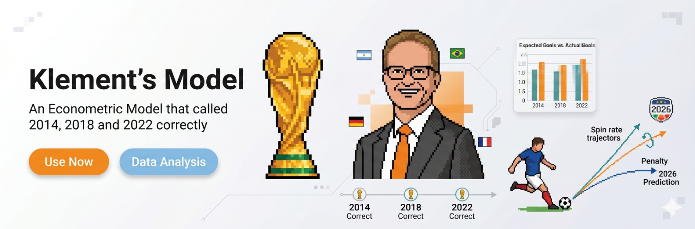
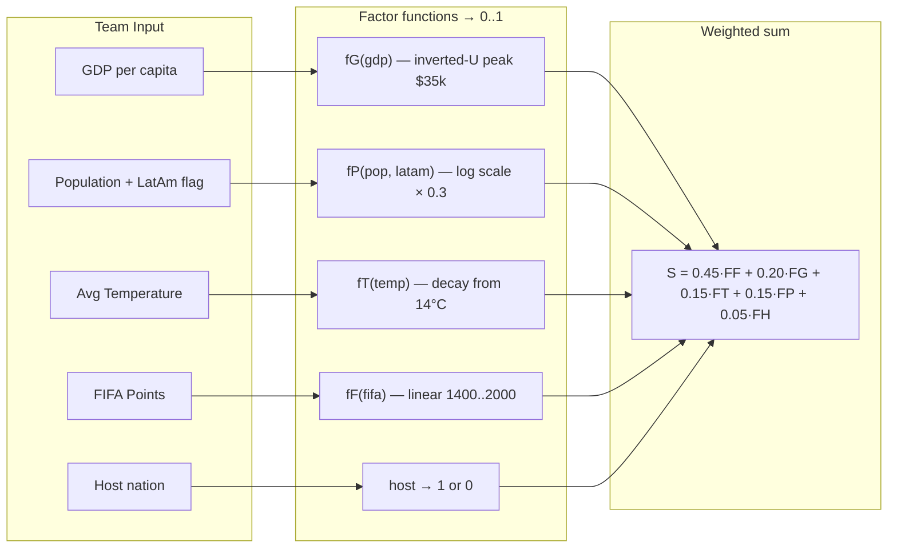
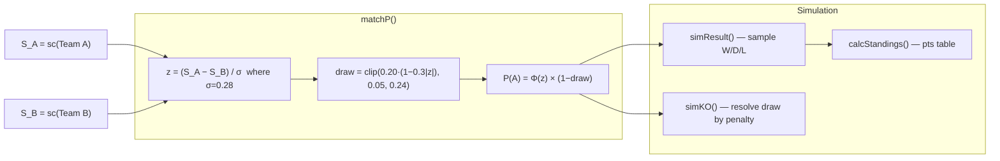

<div align="center">


# WC26 Klement


**An econometric model that called 2014, 2018 and 2022 correctly — now running on all 48 teams.**

[](https://x.com/klementworldcup)


</div>

WC26 Klement is a Next.js app that surfaces Joachim Klement's econometric World Cup forecast (Panmure Liberum, April 2026) as an interactive match predictor. Enter any two of the 48 qualified teams, get W/D/L probabilities from the model, explore each team's factor breakdown, simulate the full bracket with Monte Carlo, and see Klement's headline prediction — Netherlands win their first ever World Cup.

---

## What it does

- **Match Lookup** — Select any two of 48 teams to get win/draw/loss probabilities from the econometric model, plus side-by-side factor breakdowns
- **Team Profiles** — Explore each team's GDP, population, climate, FIFA ranking, and home advantage score; head-to-head probability vs top opponents
- **Group Stage** — All 12 groups simulated client-side on load with round-robin W/D/L standings
- **Knockout Bracket** — Klement's predicted bracket from R32 to the Final, with his picks highlighted
- **Monte Carlo** — Run 100–5,000 full tournament simulations in the browser; see the champion distribution sorted by frequency
- **Model Explainer** — Formula, factor weights, the luck component (σ = 0.28), and Klement's sources
- **Live Rankings** — GitHub Actions fetches the FIFA API every Thursday and patches `teams.json`, then triggers ISR revalidation

---

## Key features

| Feature | Description |
|---|---|
| Klement Model | W/D/L only — no score prediction. R² ≈ 0.55, σ = 0.28 noise. |
| 48 Teams | All qualified teams with GDP, pop, temp, FIFA pts, LatAm and host flags |
| Pure model functions | `sc`, `matchP`, `simResult`, `simKO`, `calcStandings` — no side effects, no API calls |
| Client-side simulation | All randomness runs in the browser. No data sent to any server. |
| Weekly rankings update | GitHub Actions cron patches `teams.json` every Thursday from the FIFA API |
| Trionda Light design | Color system inspired by the Adidas Trionda FIFA WC 2026 ball |
| Glass aesthetic | Subtle `backdrop-filter` glass cards + color panel strips (blue/red/green) |
| Plus Jakarta Sans | Geometric sans heading font paired with Inter for body copy |

---

## The model

```
S_i = 0.20·fG(gdp) + 0.15·fP(pop, latam) + 0.15·fT(temp) + 0.45·fF(fifa) + 0.05·host

P(A wins) = Φ((S_A − S_B) / 0.28) × (1 − draw)
draw      = clip(0.20 × (1 − 0.3 × |z|), 0.05, 0.24)
```

where Φ is the standard normal CDF and σ = 0.28 encodes the 45% unexplained variance as built-in luck.

### Klement's 2026 prediction

🇳🇱 **Netherlands** win their first ever World Cup — path through Morocco (R32), Canada (R16), France (QF), Argentina (SF), and Portugal in the Final.

⚡ **Biggest upset:** Japan defeat Brazil in the Round of 32.

---

## Model pipeline

### 1 — Scoring (sc function)



### 2 — Match probability and simulation (matchP / simResult / simKO)



---

## Tech stack

| Layer | Technology |
|---|---|
| Framework | Next.js (App Router, TypeScript) |
| Styling | Tailwind CSS v4 — `@theme {}` tokens in CSS |
| Fonts | Plus Jakarta Sans (headings) via `next/font/google` · System font stack for body (SF Pro / Segoe UI) |
| Animations | Framer Motion — page transitions + `whileInView` scroll reveals |
| Model | Pure TypeScript in `lib/klement.ts` — no external math libraries |
| Data | `lib/teams.json` — static, frozen at Klement's April 2026 values |
| Rankings update | GitHub Actions cron → Node.js script → ISR revalidation |
| Deploy | Vercel |

---

## Setup

```bash
# 1. Clone
git clone https://github.com/x-cookie/kalsh-main.git
cd kalsh-main

# 2. Install dependencies
npm install

# 3. Configure environment (optional — only needed for ISR revalidation)
cp .env.local.example .env.local
# Fill in REVALIDATE_TOKEN and NEXT_PUBLIC_APP_URL

# 4. Start development server
npm run dev
# -> http://localhost:3000
```

| Variable | Required | Description |
|---|---|---|
| `REVALIDATE_TOKEN` | No | Secret for `/api/revalidate` endpoint (used by GitHub Actions) |
| `NEXT_PUBLIC_APP_URL` | No | Production URL for on-demand ISR trigger |

---

## Project structure

```
klement-model/
├── app/
│   ├── layout.tsx               ← Root layout, Plus Jakarta Sans + Inter, Nav
│   ├── page.tsx                 ← Landing page — 6 marketing sections
│   ├── globals.css              ← Trionda Light tokens, glass-card, animations
│   ├── lookup/page.tsx          ← Match predictor (team pair → WDL + factors)
│   ├── teams/page.tsx           ← Team profile (hero card + factor bars + H2H)
│   ├── mc/page.tsx              ← Monte Carlo simulator
│   ├── groups/page.tsx          ← 12 group-stage cards with simulated standings
│   ├── knockout/[round]/        ← r32 | r16 | qf | sf | final
│   ├── about/page.tsx           ← Model explainer, formula, references
│   └── api/revalidate/route.ts  ← ISR revalidation endpoint
│
├── components/
│   ├── ui/
│   │   ├── Nav.tsx              ← Sticky nav with active-route highlighting
│   │   ├── WDLBar.tsx           ← Win/Draw/Loss probability bar
│   │   ├── Tag.tsx              ← Pill label (blue / red / green / gray)
│   │   ├── Btn.tsx              ← Button/link (primary | green | default | ghost)
│   │   ├── HeroBanner.tsx       ← CSS conic-gradient Trionda ball graphic
│   │   ├── PageTransition.tsx   ← Framer Motion page wrapper
│   │   └── SectionLabel.tsx     ← Uppercase section header
│   ├── match/
│   │   ├── MatchCard.tsx        ← Knockout match card with Klement pick badge
│   │   ├── GroupMatchRow.tsx    ← Inline group match row
│   │   └── GroupCard.tsx        ← Group standings + collapsible match rows
│   ├── team/
│   │   ├── TeamHeroCard.tsx     ← Flag, model score, FIFA pts, GDP
│   │   ├── FactorBreakdown.tsx  ← 5-factor weighted bar chart
│   │   └── H2HList.tsx          ← Head-to-head vs top 6 opponents
│   └── landing/
│       ├── HeroSection.tsx      ← Above-the-fold, CTA, trust bar
│       ├── TrackRecordSection.tsx ← 2014/2018/2022 prediction cards
│       ├── HowItWorksSection.tsx  ← 5 factor rows
│       ├── LivePreviewSection.tsx ← Interactive mini-predictor
│       ├── KlementCallSection.tsx ← Netherlands prediction + upset callout
│       └── FooterCTA.tsx          ← Final conversion CTA
│
├── lib/
│   ├── klement.ts               ← Pure model: sc, matchP, simResult, simKO, calcStandings
│   ├── teams.json               ← 48 teams — frozen at Klement's April 2026 values
│   └── fixtures.ts              ← GROUPS (12×4) + ROUNDS (r32→final) + Klement picks
│
├── types/index.ts               ← TeamData, WDL, MatchResult, SimResult, Standing
├── scripts/fetch-rankings.js    ← FIFA API → teams.json patcher (run by CI)
└── .github/workflows/
    └── update-rankings.yml      ← Weekly Thursday cron
```

---

## Hard rules (do not violate)

1. **No score prediction.** W/D/L only. Poisson was tried and removed.
2. **No dark mode.** Light only.
3. **`teams.json` is the single source of truth.** Never hardcode team values inline.
4. **Klement picks are hardcoded in `fixtures.ts`** — not auto-generated from model scores.
5. **All model functions are pure.** No API calls inside `lib/klement.ts`.
6. **Simulation is client-side only.** `'use client'` on any component calling `simResult`/`simKO`.
7. **Group standings come from simulated W/D/L**, not sorted by model score.

---

## Attribution

- **Klement, J. (2026).** *FIFA World Cup 2026 Predictions.* Panmure Liberum Research, 9 April 2026.
- **Hoffmann, R., Ging, L.C. & Ramasamy, B. (2002).** The socioeconomic determinants of international soccer performance. *Journal of Applied Economics*, 5(2), 253–272.
- Design system inspired by the Adidas Trionda — official match ball of FIFA World Cup 2026.

This project is an independent fan tool and is not affiliated with or endorsed by Panmure Liberum, FIFA, or Adidas.

## License

MIT
